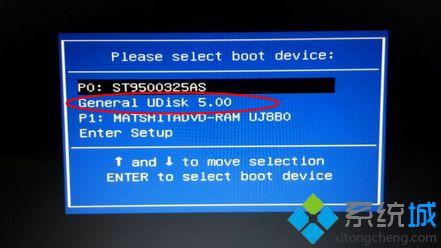
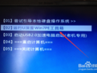
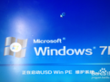
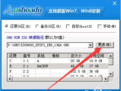
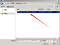
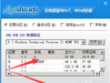
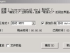
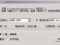
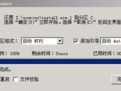
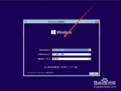

# PEWIN10安装

标签（空格分隔）： PE WIN10系统安装

---

大白菜的PE盘制作教程网站：http://www.dabaicaipe.cn/upqdzz.html
OS（操作系统）：Windows 、server、Linux（发行版）：Ubuntu、centOS、红旗、红帽redhat、UNIX

1.首先要进入BIOS，在需要装系统的电脑上插入U盘，重启后不停按F12、F11、Esc等快捷键打开启动菜单（快捷键因PC型号不同略有区别），选择进入BIOS界面。选择U盘选项回车，比如General UDisk 5.00，不支持这些启动键的电脑查看第二点设置U盘启动方法；

2.接着选中从PE启动

3.PE启动中

4.进入PE系统之后
运行PE装机工具

5.点击更多打开你的Win10 的镜像文件

6.选中中Win10镜像

7.选中要安装到的分区后点击确定

8.点击确定开始安装

9.安装中

10.安装完成之后请重启电脑

11.拔掉你的U盘
然后启动计算机
我们就来到了Win10的安装界面了

